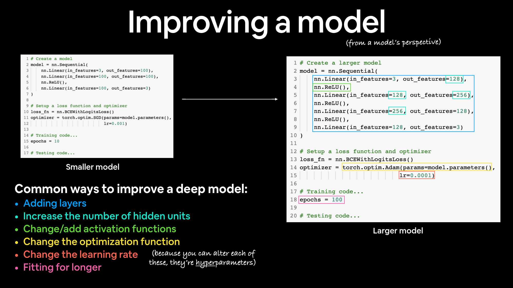

# Como melhorar o modelo

- Como Melhorar o modelo
    
    
    | Técnica de melhoria do Modelo | O que faz |
    | --- | --- |
    | Adicionar mais camadas | Cada camada aumenta potencialmente a capacidade de aprendizado do nosso modelo, com cada camada sendo capaz de aprender algum tipo de novo padrão nos dados. Mais camadas são referidas como tonando sua rede neural mais profunda |
    | Adicionar mais unidades escondidas | Semelhante ao acima, mais unidades ocultas por camada significa um aumento potencial nas capacidades de aprendizagem do modelo. Mais unidades ocultas são muitas vezes referidas como tornando sua rede neural mais ampla. |
    | Deixando por mais tempo(mais épocas) | Seu modelo pode aprender mais se tiver mais oportunidades de olhar os dados |
    | Trocando a ativação das funções | Alguns dados apenas não cabem apenas com linhas retas, usando funções de ativação não-lineares pode ajudar com isso. |
    | Mudando a taxa de aprendizado | Menos específico do modelo, mas ainda relacionado, a taxa de aprendizado do otimizador decide o quanto um modelo deve alterar seus parâmetros a cada etapa: muito e o modelo corrige demais, muito pouco e ele não aprende o suficiente. |
    | Mudando a função de perda | De novo, menos específico do modelo, mas ainda importante, problemas diferentes exigem funções de perda diferentes. Por exemplo, uma função de perda de entropia cruzada binária não funcionará com um problema de classificação multiclasse. |
    | Use a aprendizagem por transferência | Pegue um modelo pré-treinado de um domínio de problema similar ao seu e ajuste-o ao seu próprio problema. Cobrimos a aprendizagem de transferência no https://www.learnpytorch.io/06_pytorch_transfer_learning/ |
    
    