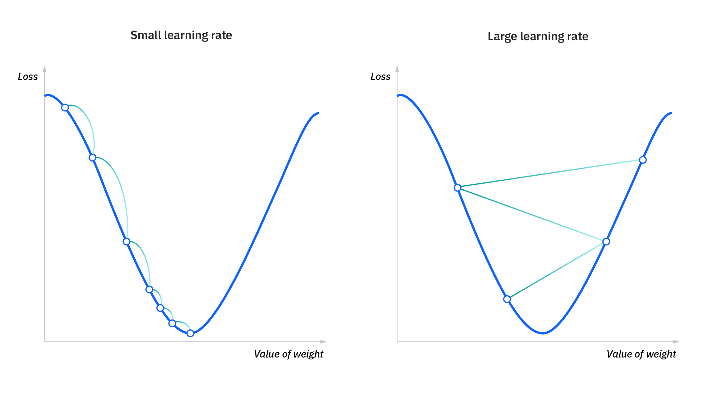
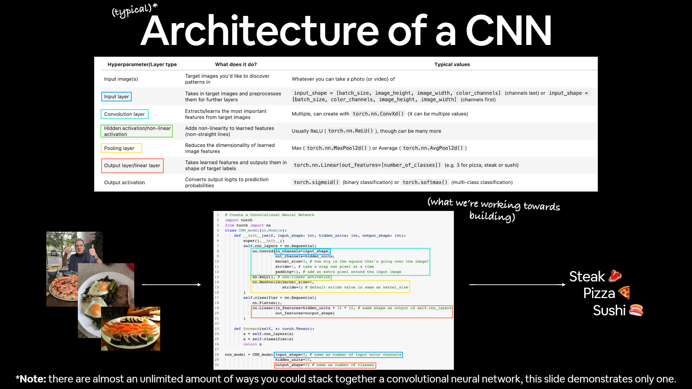

# Conceitos usados em ML

- Regressão linear
    
    `Regressão linear:`
    Modelo estatístico usada para prever o valor de uma variável que busca modelar a relação entre uma variável dependente (variável que desejamos prever) e uma variável independente(variável que usamos para prever o valor da outra variável) através de uma função linear.
    
    $$
    y = m*x + b
    $$
    
    ```
    sendo:
        m - representação de inclinação
        b - bias (interceptação no eixo y)
        x - variável dependente
        y - variável independente
    ```
    
- Gradiente
    
    O  [gradiente](https://pt.khanacademy.org/math/multivariable-calculus/multivariable-derivatives/partial-derivative-and-gradient-articles/a/the-gradient) armazena todas as informações da derivada parcial de uma função multivariável. Porém, ele é mais do que um simples dispositivo de armazenamento: ele tem diversas interpretações maravilhosas e muitos usos.
    
    Funções com uma entrada multidimensional têm [derivadas parciais](https://pt.khanacademy.org/math/multivariable-calculus/multivariable-derivatives/partial-derivative-and-gradient-articles/a/g/a/introduction-to-partial-derivatives/), você pode se perguntar qual é a derivada total de uma função desse tipo. No caso de **funções multivariáveis com valor escalar**, ou seja, funções com entrada multidimensional mas com resultado unidimensional, a resposta é o gradiente.
    
    O gradiente de uma função multivariável de valores escalares(x, y , ), denotado por , contém todas as informações em um vetor:
    
    $$
    \nabla f = \begin{bmatrix}
        \dfrac{\partial f}{\partial  x} \\ \\ \dfrac{\partial f}{\partial y}  \\ \\ ⋅\\⋅\\⋅
    
    \end{bmatrix}
    $$
    
- Gradiente Descendente:
    
    O [gradiente descendente](https://www.ibm.com/br-pt/topics/gradient-descent) é um algoritmo de otimização comumente usado em aprendizado de maquina para treinar modelos. Ele treina os modelos de aprendizado de maquina ao minimizar os erros entre os resultados previstos e os reais.
    Similar ao processo de encontrar a linha de melhor ajuste na regressão linear, o objetivo do gradiente descendente é minimizar a função de custo ou o erro entre o y previsto e o y real. Para fazer isso, são necessários dois pontos de dados: uma direção e uma taxa de aprendizado. Esses fatores determinam os cálculos das derivadas parciais das iterações futuras, o que permite alcançar gradualmente o mínimo local ou global (ou seja, o ponto de convergência).
    
    `tava de aprendizado:`é o tamanho de etapas para atingir o mínimo(taxa de aprendizado menor é mais precisa )
    
    `função de perda(ou perda)`:A [função de perda](https://www.ibm.com/br-pt/think/topics/loss-function?mhsrc=ibmsearch_a&mhq=gradiente) é um tipo de *função objetiva* que, no contexto da [ciência de dados,](https://www.ibm.com/br-pt/topics/data-science) se refere a qualquer função cuja minimização ou maximização represente o objetivo do treinamento do modelo.
    
    Mede a diferença entre o `y real` e o `y previsto` na sua posição atual. Ele itera continuamente, movendo-se ao longo da direção da descida mais íngreme (ou do gradiente negativo) até que a função de custo esteja próxima ou em zero.
    
    Função de perda se refere ao erro de um exemplo de treinamento
    
    Função de custo calcula o erro médio em todo um conjunto de treinamento.
    
    
    
    ---
    
- Retropopagção
    
    ---
    
     O [Backpropagation](https://www.ibm.com/br-pt/think/topics/backpropagation?mhsrc=ibmsearch_a&mhq=gradiente) é a tecnica específica para implentar a descida do gradiente no espaço de pesos para uma rede de múltiplas camadas.
    
    Primeiro, em uma passagem adiante, um modelo é alimentado com algumas entradas (*x*) e prevê algumas saídas (*y*); trabalhando para trás a partir dessa saída, é utilizada uma função de perda para medir o erro das previsões do modelo em valores diferentes de *x*. Diferenciando essa função de perda para encontrar sua derivada, [a gradiente descendente](https://www.ibm.com/br-pt/topics/gradient-descent) pode ser utilizada para ajustar os pesos na rede neural, uma camada de cada vez.
    
    O módulo autograd do PyTorch alimenta sua técnica de diferenciação automática com uma fórmula de cálculo chamada *regra de cadeia*, calculando derivados complexos e dividindo-os em derivados mais simples e combinando-os mais tarde. O Autograd calcula e registra automaticamente gradientes para todas as operações executadas em um gráfico computacional, reduzindo muito o trabalho de legenda de backpropagation. 
    Executando um modelo que já foi treinado, o autograd passa a ser um uso desnecessário de recursos computacionais. A anexação de qualquer operação do tensor com *requires_grad=False* sinalizará PyTorch para parar de rastrear gradientes.
    
    
    
- Fine Tunning
    
    
- Peso e Bias
- CrossEntropy
    
    A entropia é uma medida de incerteza associada a uma distribuição q(y), definida pela seguinte formula, onde C é o número de classes existentes numa distribuição:
    
    $$
    H(q)= - \sum_{c=1}^{c}q(y_{c})*log(q(y_{c}))
    $$
    
    onde a entropia de uma distribuição é definida por:
    
    $$
    H(q) = log(2)
    $$
    
    Então se conhecermos a verdadeira distribuição de uma variável, conseguimos calcular sua entropia
    
    Mas, e se **NÃO** conhecermos? Podemos tentar **aproximar a verdadeira distribuição** com alguma outra **distribuição**, tipo, **p(y)**?
    
    ## [Entropia Cruzada](https://medium.com/ensina-ai/uma-explica%C3%A7%C3%A3o-visual-para-fun%C3%A7%C3%A3o-de-custo-binary-cross-entropy-ou-log-loss-eaee662c396c) **(Cross-Entropy)**
    
    Podemos supor que nossos **pontos seguem** essa **outra** distribuição **p(y)**. Porém, **sabemos** que esses **pontos** são **provenientes** da **verdadeira** (*e desconhecida*) distribuição **q(y)**. Se calcularmos a **entropia** dessa forma, na realidade, estaremos calculando a **entropia cruzada** entre as duas distribuições:
    
    $$
    H(q)= - \sum_{c=1}^{c}q(y_{c})*log(p(y_{c}))
    $$
    
    Se, por milagre, conseguirmos *bater* **p(y)** com **q(y)** *perfeitamente*, ambos valores calculados, da **entropia cruzada** e da **entropia**, *vão bater* também.
    
    Já que isso provavelmente não vai acontecer nunca, a **entropia cruzada vai ter um valor MAIOR que o da entropia** calculada a partir da verdadeira distribuição.
    
    $$
    H_{p}(q)- H(q) \geqslant 0 
    $$
    
    CrossEntropyLoss:
    
- Redes Convolucionais
    
    187 
    
    204 - resumo sobre retropropagação
    
    271 -redes convolucionais 
    
    
    
    .png)
    
    .png)
    
- Congelar camadas
    
    By freezing it means that the layer will not be trained. So, its weights will not be changed.
    
    **Why do we need to freeze such layers?**
    
    Sometimes we want to have deep enough NN, but we don't have enough time to train it. That's why use pretrained models that already have usefull weights. The good practice is to freeze layers from top to bottom. For examle, you can freeze 10 first layers or etc.
    
    ---
    
    *For instance, when I import a pre-trained model & train it on my data, is my entire neural-net except the output layer freezed?*
    
    - Yes, that's may be a case. But you can also don't freeze a few layers above the last one.
    
    *How do I freeze and unfreeze layers?*
    
    - In keras if you want to freeze layers use: `layer.trainable = False`
    
    And to unfreeze: `layer.trainable = True`
    
    *If so how do I determine which layers to unfreeze & train to improve model performance?*
    
    - As I said, the good practice is from top to bottom. You should tune the number of frozen layers by yourself. But take into account that the more unfrozen layers you have, the slower is training.
    
    When training a model while transfer layer, we freeze training of certain layers due to multiple reasons, such as they might have already converged or we want to train the newly added layers to an already pre-trained models. This is a really basic concept of Transfer learning and I suggest you go through this [article](https://www.mygreatlearning.com/blog/transfer-learning/) if you have no idea about transfer learning .
    
- Convergência
    
    O algoritimo de retropropagação usa uma “estima instantãnea” para o gradiente da superficie de erro no espaço de pesos. O algoritmo é, portanto, de natureza estocástica
    
- 
- Transfer learning

---