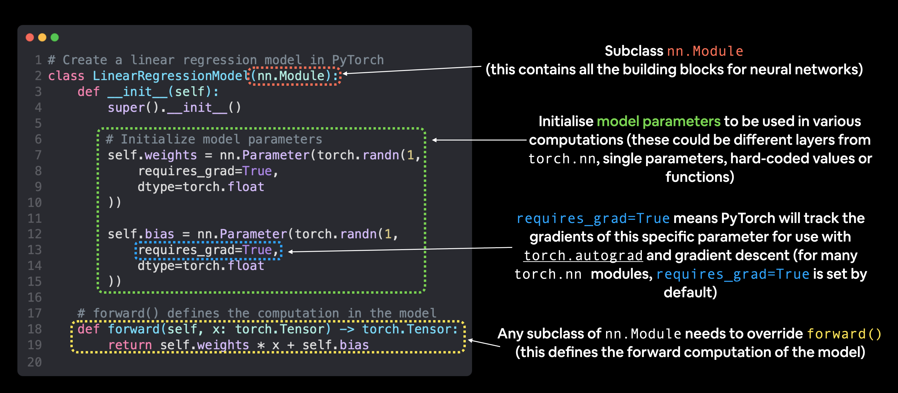

# Pytorch build-essentials

[pytorch build-essentials](https://www.learnpytorch.io/01_pytorch_workflow/)
`nn.Module` Contem grandes quantidades de blocos de construção(camadas)
 `nn.Parameter` contem os pequenos parâmetros como pesos e bias (colocando tudo juntos para fazer `nn.Module`
`forward():`  informa os blocos maiores sobre como fazer os cálculos de entradas dentro de `nn.Module`(s). Como a rede computa(o q a rede vai fazer com o dado(x))
`torch.optim:`contem métodos de otimização  sobre como melhorar os parâmetros dentro `nn.Parameter` para uma melhor representação de entrada de dados.



`otimizador.zero_grad():` Zera os gradientes dos parâmetros do modelo. Isso é necessário porque, por padrão, [PyTorch](https://pytorch.org/) acumula os gradientes  em vez de sobrescrevê-los.

- optmizador: código de optimização q serve para o ajuste dos gradientes no decorrer do treinamento.
- fine-tunning: O [fine-tunning](https://www.ibm.com/br-pt/think/topics/fine-tuning?mhsrc=ibmsearch_a&mhq=fine-tunning) é o processo de adaptação de um modelo treinado previamente para tarefas
- Torch.nn.ReLU( [Rectified Linear Unit](https://machinelearningmastery.com/rectified-linear-activation-function-for-deep-learning-neural-networks/)) é a ativação de uma função usada em modelos de aprendizados, comumente usada em hidden layers, ela retorna 0 se recebe uma entrada negativa, se for positivo, mantém o valor.
- Torch squeeze: é uma função do pytorch que remove dimensões de tamanho 1 da superfície de um tensor. Se não especificar nenhuma dimensão, irá remover todas as dimensões de tamanho 1. Também podemos especificar dimensões para ‘squeeze’(ou espremer, em português)  passando uma lista de dimensões para o parâmetro dim.
    
    ```python
    import torch
    t = torch.zeros(5, 1, 6, 1, 7, 1)
    squeezed = t.squeeze().unsqueeze(2)
    print(squeezed.shape)  # Output: torch.Size([5, 6, 1, 7])
    ```
    
- Tensor: é uma matriz n-dimensional
- neurônio: é uma função que leva múltiplas entradas e campos a uma saída
- camada: é uma coleção de neurônios com a mesma operação incluindo seus super parâmetros
kernel weights e biases
- torch.softmax: Redimensiona-os para que os elementos do Tensor de saída n-dimensional fiquem no intervalo [0,1] e somem 1.  Dado pela expressão:
    
    $$
    Softmax(x{i}) = \frac{exp(x{i})}{\sum_{j}^{{}}exp(x{j})}
    $$
    
    exemplo de código:
    
    ```python
    m = nn.Softmax(dim=1)
    input = torch.randn(2, 3)
    output = m(input)
    ```
    
- ToTensor(): converte uma  [PIL Image](https://pillow.readthedocs.io/en/stable/reference/Image.html) ou numpy.ndarray para tensor
    - Pillow Image
        
        Cria uma copia da memória da imagem dos dados de pixels contidos no buffer
        
- Batch_size:  Define o tamanho do lote de dados (imagens), ou seja, quantas imagens serão processadas por vez (época).
- Max pool layer:
- model.eval():